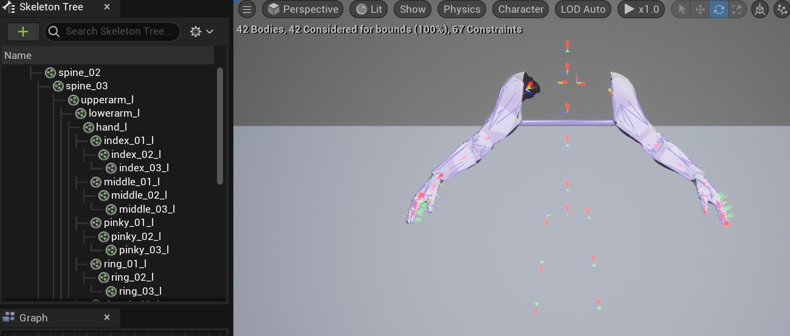

## Physics Asset Creation
The tool is designed to create and assign a physics asset during the Merge-and-View stage

The physics asset follows rules to limit movement within human limb tolerances

The tool generates a single convex hull as a catch-all

This is in no way meant to be a final production asset

It is designed to be a basic starter asset to speed-up iteration time

Important Note:
---
Since it creates an asset during every Merge-and-View, 
the user should delete any unused/unsuitable assets to avoid an overflow and avoid confusion
