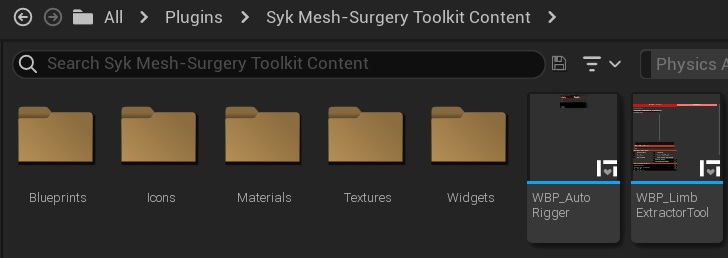
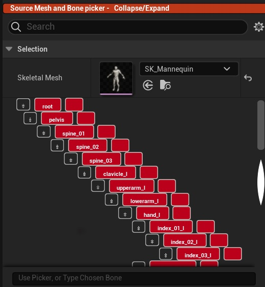
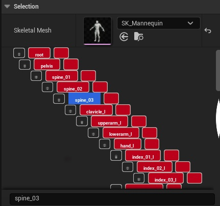
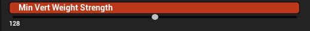
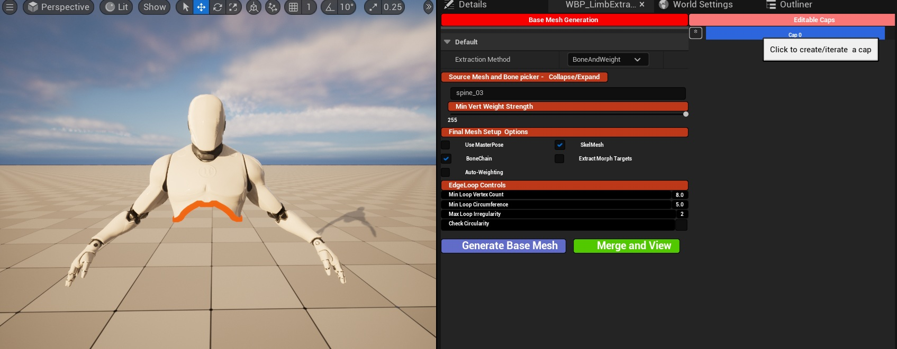
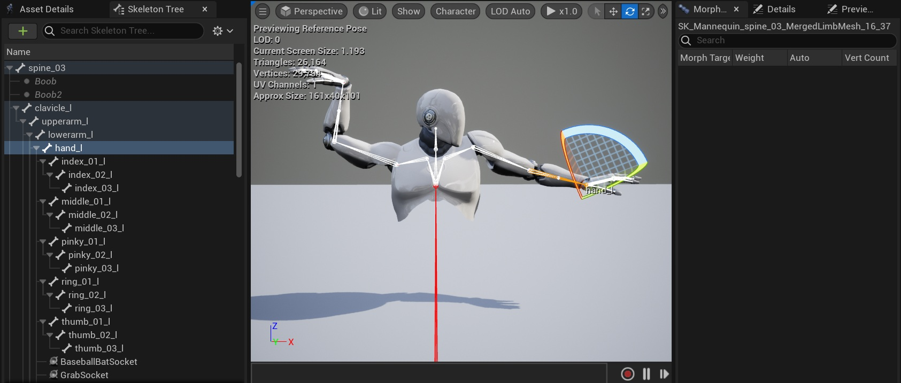

## 1. Open the Limb Extractor Tool

Navigate to All/Plugins/SkelMeshSliceTool Content/WBP_LimbExtractorTool

Navigate to WBP_LimbExtractorTool - Right Click and select 'Run Editor Utility Widget'

The tool runs editor-only and DOES NOT modify the source mesh

## 2. Select a Skeletal Mesh

Assign a Skeletal Mesh in the picker

Once selected, the skeleton hierarchy will be available for bone-chain selection

## 3. Choose a Bone

Choose a Bone from the hierachy

Set BoneChain to true to extract the entire bones child hierachy

## 4. Choose an Extraction Method

You can extract a limb in one of two ways:

Bone Chain Selection
Select a root bone (e.g. upperarm_l, spine_03) to extract a continuous chain

Cut Plane Tool (Optional) - 
Use the Cut Plane Gizmo to manually define a separation point

Bone-chain extraction is recommended for first use.

## 5. Set the Weight Threshold

Start with a value between 125 – 255 (recommended default)

Higher values include more vertices and produce a more complete mesh

Lower values are more restrictive and may introduce holes

If no vertices meet the threshold, mesh generation will fail.

## 6. Generate the Mesh

Click Generate Mesh

A new skeletal mesh asset will be created with:

Preserved bind pose alignment

Filtered and renormalized skin weights

Optional procedural capping

## 7. Merge / View Result

Use Merge / View to preview the extracted limb

Important Note:
- if Use Masterpose is set to false, dialog will pop-up asking to regenerate the skeleton.
  This is normal behaviour, select Yes to let Unreal rebuild animation
  
Generated meshes are compatible with:

Props

Modular characters

Master Pose setups

## Recommended First-Time Settings

Weight Threshold: 255

BoneChain: true

Auto Skin Weighting: Enabled

## Common First-Time Issues

Mesh missing sections → Increase Weight Threshold

Holes near joints → Increase Weight Threshold or adjust bone chain

No mesh generated → Threshold too restrictive or invalid bone chain

Weights pulling towards origin -> Extraction results vary depending on prior skinweights. Set Auto-Skinweight to true
