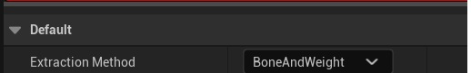
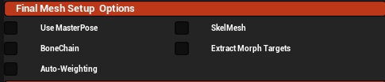
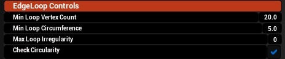
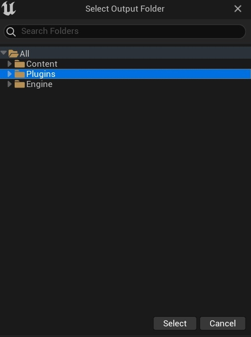

## Bone Weight Extraction
The steps to extract using Bone Weights are straighforward and user friendly

Some options are hidden depending on the chosen settings to reduce user confusion

## Getting Started
Step 1:
---
Set the extraction method to 
- BoneAndWeight

   
  
Step 2:
---
Using the mesh picker, select a Skeletal Mesh

- The Tree View will populate with the mesh’s complete skeleton hierarchy
- Use the arrows next to each bone to expand or collapse its child hierarchy

Step 3:
---
You can:

- Click the bone name in the Tree View
- Or manually type the bone name into the text box and press Enter

Once selected, the bone name remains visible until:

- Another bone is selected
- The Skeletal Mesh is swapped
- The Skeletal Mesh is cleared

Excluding Bones

Any bones you wish to exclude from the extraction chain can be added by pressing the blank button next to the bone name.

- The button will highlight and display “Excluded” as a visual reminder
- Press the button again to remove the bone from the exclusion list

Once your selection is complete, you may collapse the Tree View to reduce clutter using:

Source Mesh and Bone Picker – Collapse / Expand

Step 4:
---
Choose the desired Final Mesh Setup Options: 

Use Master Pose:
- True includes the entire skeleton in an extracted section
  ensuring Modular Mesh compatibility

- False creates a partial skeleton using only the selected bone/chain
  This is NOT Modular Mesh compatible, skinning will NOT align with Modular meshes
  and is intended for props/physics objects

Bone Chain:
- True includes the selected bone and all of its child hierachy
- False includes only the selected bone

AutoWeighting:
- True discards extracted skin weights and applies auto-skinning which may improve bad weights
  Refer to [Auto-Weighting Controls](Reference/UIMeshControls.md)
- False preserves the original skin weights
- 
PruneToMAXInfluences:
- If a mesh has more than 4 influences per vert, this will prune it to MAX 4 as per UE's convention

Extract Morph Targets:
- True extracts and applies relevant morph targets
- False skips morph target extraction

SkelMesh:
- True generates a Skeletal Mesh
- False generates a Static Mesh

Apply Gradient Skinning
- If not in Masterpose mode, we can weight the cut zones to the bone chain parent, 
  so the cut zone will deform and have skinweight

  Blendzone Amount:
  - How much the cutzone Gradient Skinning blends into the neighbouring zone
 
  Edgeloop Reskin Strength
  - How strongly the Gradient skinning will affect the cutzone

Step 5:
---
Select the Vert Strength by moving the slider:

Lower value 
- Reduce the amount of mesh extracted
- Reduce morph target quality (if enabled)
- May create holes and additional edge loops
  (This is sometimes desired behaviour)

Higher value
- Increase the amount of mesh extracted
- Improve morph target quality (if enabled)
- Reduce the number of detected edge loops

It is recommended to use a value between 128 - 255 for optimal results

Step 6:
---
If the source mesh is topologically complex, edge loop filtering can reduce clutter.

Recommended settings for a standard human mesh:

- Min Loop Vertices: 8
  (Increase for dense meshes or complex hair topology — 20+)
- Min Loop Circumference: 2
  (Includes small loops such as excluded fingers)
- Max Loop Irregularity: 2
- Check Circularity: False

Step 7:
---
Press Generate Base Mesh.

Then:

1. Select the mesh in the World Outliner
2. Open the Details tab
3. Select the Skeletal Mesh Component
4. Open the mesh in Persona

Verify:

- Deformation
- Morph targets
- Animation
- UVs
- Materials

Step 8:
---
The user may now create caps using the Cap-Data widgets in the capping menu

Refer to [Cap Controls](Reference/CappingMenuControls.md)

Important note:
Once a cap is created, it cannot be cleared, only overwritten

Step 9:
--- 
If the generated mesh and caps are correct:

Press Merge And View

A Folder selection dialog will open.  Choose an output folder for the new mesh and press select.

A new Persona tab will open. Verify:

- Deformation
- Morph targets
- Animation
- UVs
- Materials
- Generated Physics Asset

Important Note

If the result is not suitable, you must manually delete the generated mesh and physics asset from the save folder.

Automatic cleanup is not available at this stage.
