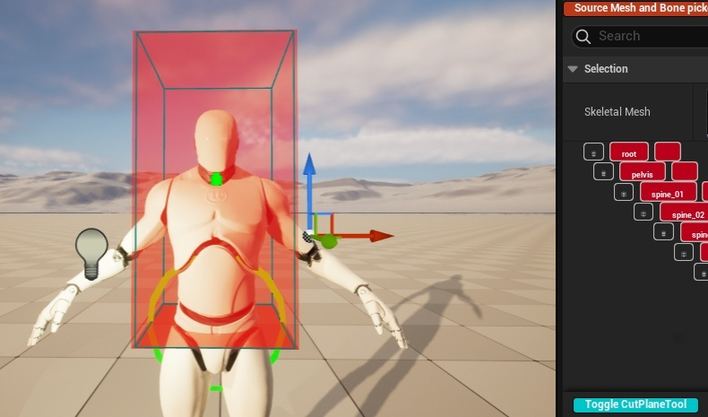
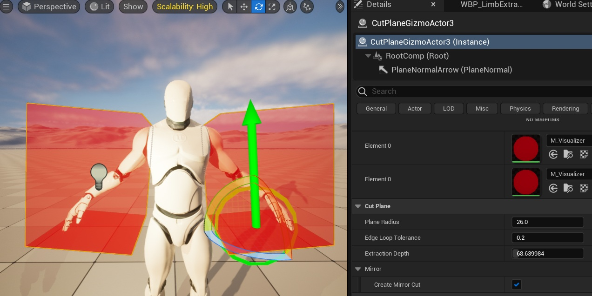
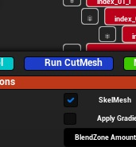
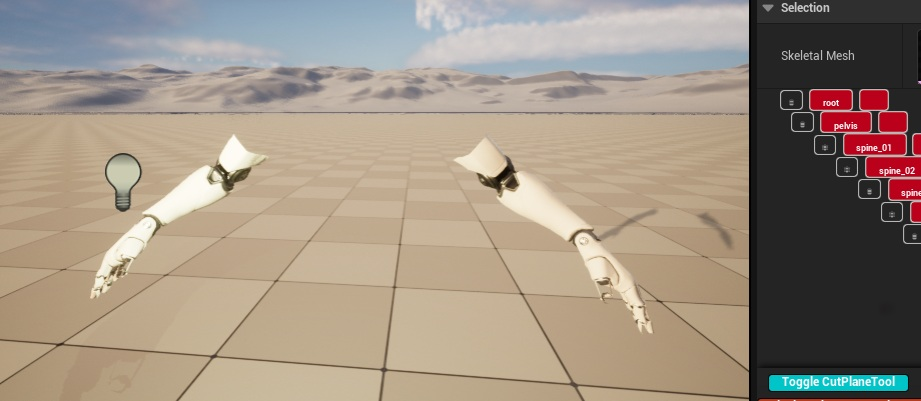
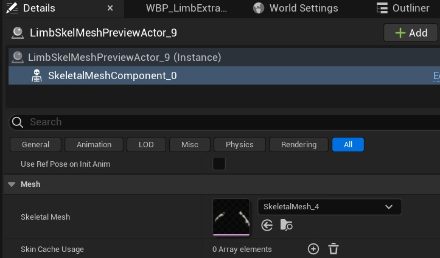
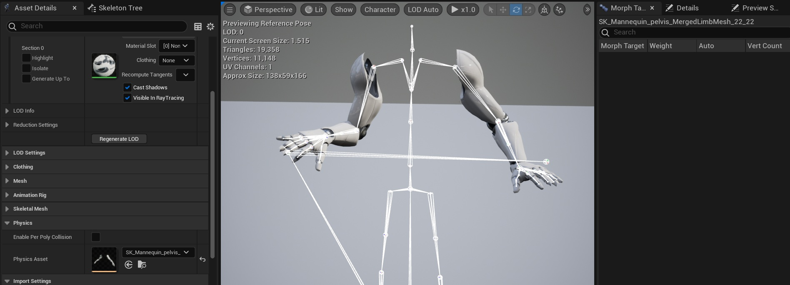
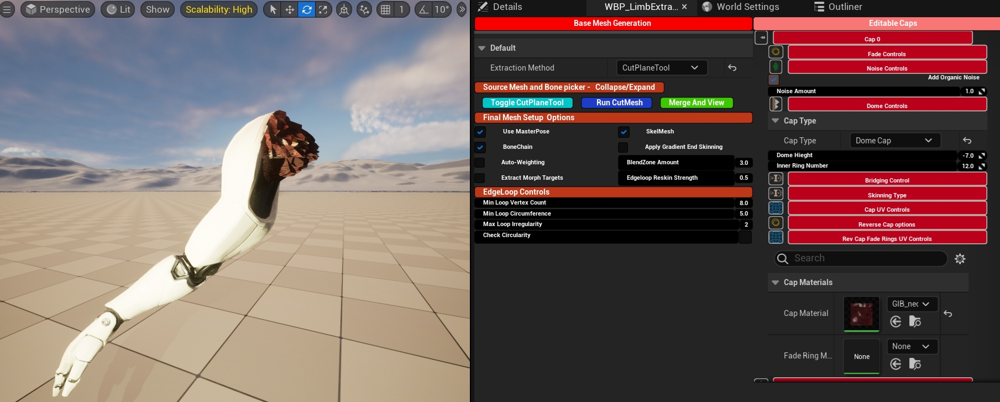
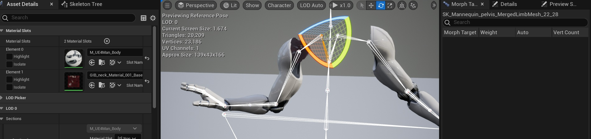

## CutPlaneTool Extraction
CutPlaneTool based extraction is simple and powerful, with the option to use Mirrored Mode 

NOTE - The tool will always create Skeletal Mesh Modular compatible parts, and try to extract Morph Targets
regardless of the Mesh Options settings. The only Mesh Option available is Auto-Weighting

Step 1:
---
Set the extraction method to 
- CutPlaneTool

Step 2:
---
Select a mesh

Collapse the Tree View to reduce clutter
Bone selection is redundant for this extraction method

Step 3:
---
Press 'Toggle CutPlaneTool

The selected mesh will appear with the CutPlaneTool in the viewport

Pressing Toggle again will remove the mesh and CutPlaneTool instance from the viewport

Step 4:
---
In the World Outliner, select the CutPlaneTool

Position the CutPlaneTool in desired location and rotation

The Red Extraction Box is the visual cue for what mesh will be included

Step 5:
---
Set the desired options in the tool

Refer to [CutPlaneToolsControls](Reference/CutPlaneToolControls.md)

Important Note:
If Mirrored mode is selected, double check the extraction box positioning

Step 6:
---
When the desired mesh is inside the extraction box: 
- Press 'RunCutMesh' in the main UI

Step 7:
--- 
Toggle the CutPlaneTool to remove the source mesh and CutplaneTool instance ffrom the viewport.

The Extracted mesh will remain

Then:

- Select the mesh in the World Outliner
- Open the Details tab
  

- Select the Skeletal Mesh Component
- Open the mesh in Persona

Verify:

- Deformation

  
  
- Morph targets
- Animation
- UVs
- Materials

Step 8:
---
The user may now create caps using the Cap-Data widgets in the capping menu

Refer to [Cap Controls](Reference/CappingMenuControls.md)

Important note:
Once a cap is created, it cannot be cleared, only overwritten.  Re-generating the mesh will clear all Caps

Step 9:
---
If the generated mesh and caps are correct:

Press Merge And View

A Folder selection dialog will appear - choose an output folder and press select.

A new Persona tab will open. Verify:

- Deformation
- Morph targets
- Animation
- UVs
- Materials
- Generated Physics Asset

If suitable, save the asset:

- Skeletal Mesh: TempMergedSkelMeshes
- Static Mesh: TempMergedStaticMeshes

Important Note

If the result is not suitable, you must manually delete the generated mesh and physics asset from the Temp folder.

Automatic cleanup is not available at this stage.
